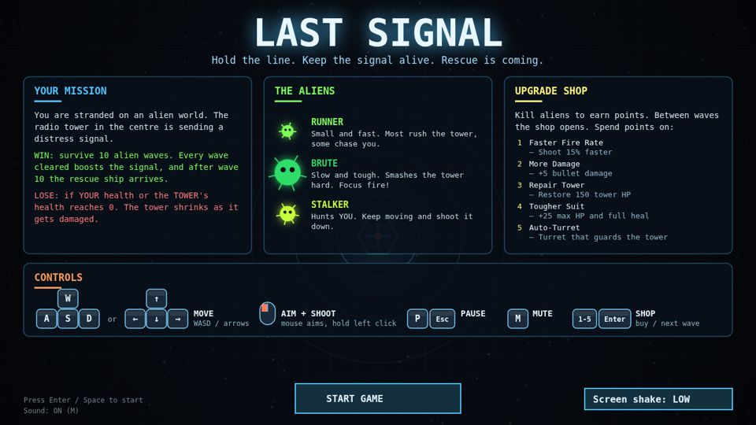
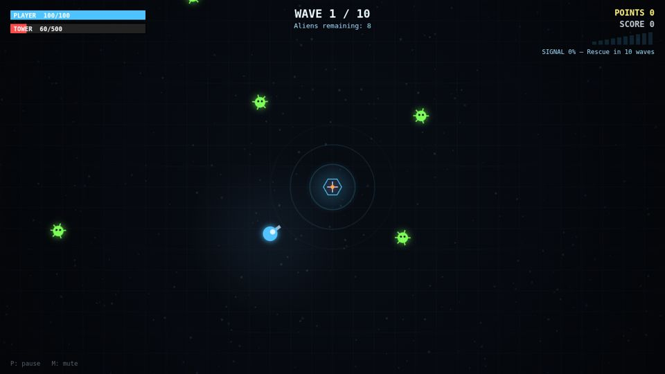
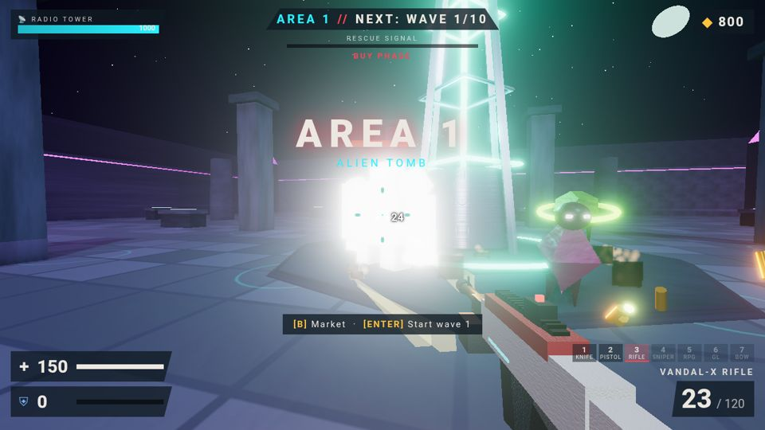
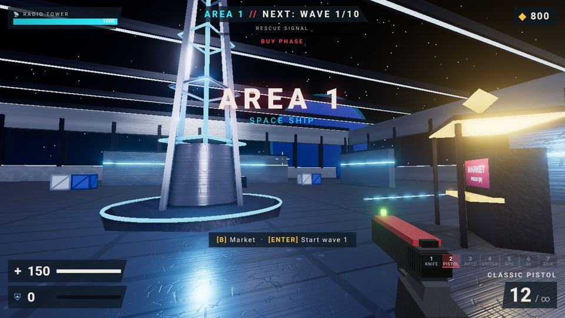

# Last Signal

## ▶ Play now (free, in your browser, nothing to download)

| | Version | Link |
|---|---|---|
| 🟦 | **2D**: top-down arcade shooter | **https://vihaankohli6527-cyber.github.io/last-signal/** |
| 🟥 | **3D**: first-person shooter (Three.js) | **https://vihaankohli6527-cyber.github.io/last-signal/3d/** |

Works in any modern desktop browser (Chrome, Edge, Firefox, Safari). You need a keyboard and mouse.

---

You're stranded on an alien world. The radio tower in the centre is your only way home, so keep it alive while waves of aliens attack it and you. Survive long enough and the rescue ship arrives.

## 2D version

[](https://vihaankohli6527-cyber.github.io/last-signal/)


- **Goal:** survive 10 waves. You lose if your health or the tower's health hits 0. The tower shrinks as it takes damage.
- **Aliens:** Runners are fast. Brutes are tanky and smash the tower. Stalkers hunt you.
- **Shop:** between waves, spend points on fire rate, damage, tower repair, a tougher suit or auto-turrets.

| Action | Keys |
|---|---|
| Move | WASD / arrow keys |
| Aim / shoot | Mouse / hold left click |
| Pause | P or Esc |
| Mute | M |
| Shop | 1–5 buy, Enter next wave |

**Phone / iPad (touch):** twin-stick. Drag on the left half to move (floating joystick) and on the right half to aim; it fires automatically while you hold it. The ❚❚ button pauses. The shop, home screen and menus all work by tapping large buttons. Touch mode turns on by itself on touch devices. On a phone held upright, the game suggests rotating to landscape (you can tap "Play anyway").

Screen shake (Off / Low / Normal) can be changed on the home and pause screens.

## 3D version

[](https://vihaankohli6527-cyber.github.io/last-signal/3d/)


Five maps, an endless campaign, a market with 7 weapons, PBR graphics, and settings for sensitivity, FOV, quality, crosshair and more.

| Action | Keys |
|---|---|
| Move / sprint / jump | WASD · Shift · Space |
| Crouch / slide | hold C / Shift + move + C |
| Fire / aim | Left click / right click (knife: right click = heavy stab) |
| Reload / inspect | R / Y |
| Weapons | 1–7, mouse wheel, Q |
| Market | B |
| Pause | Esc |

**Phone / iPad (touch):**

| Action | Touch |
|---|---|
| Move / sprint | Left joystick (push all the way forward to sprint) |
| Look | Drag on the right half of the screen (Settings → Touch look sensitivity) |
| Fire | Hold FIRE (drag from it to aim while firing) |
| Aim / scope | AIM (toggle) |
| Jump · crouch / slide | JUMP · SLIDE (sprint + SLIDE = slide) |
| Reload · switch weapon | ↻ · ⇄, or tap a weapon slot |
| Market · pause · fullscreen | 🛒 · ❚❚ · ⛶ |

Pointer lock is skipped on touch devices, and graphics default to Low on them. iOS Safari has no Fullscreen API, so use Share → **Add to Home Screen** to play full screen there.

**Map select:** hover over a map (or tap it once, or use ←/→) to see a live 3D fly-around of the real map, with its mood and difficulty. Click to select. Double-click, tap a second time, or press DEPLOY to start. The Low preset and slow devices show pre-rendered pictures instead.

More details are in [`3d/README.md`](3d/README.md).

## Repository layout

```
index.html, css/, js/   2D game (served at the site root)
3d/                     3D game (served at /3d/)
media/                  README screenshots
tools/sync-2d.py        copies the 2D game in from its source folder and stamps ?v= cache-busting
3d/tools/bump-version.py  stamps ?v= cache-busting on the 3D modules
```

Releasing: run `python3 tools/sync-2d.py` (2D) and/or `python3 3d/tools/bump-version.py` (3D), then commit and push to `main`. GitHub Pages updates in about a minute.
